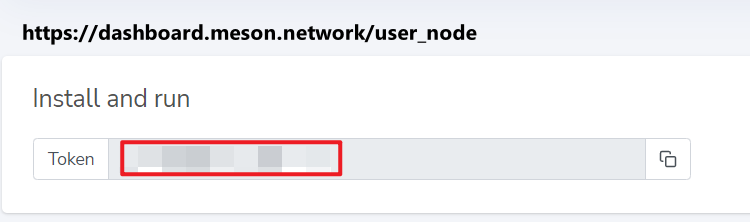

# API Library for Meson Network

::: tip Preparation
After you have registered your account in [Meson Network's dashboard](https://dashboard.meson.network/user_node), you will get a Token 🔐. It is the same token you use to deploy your nodes.
:::



[[toc]]

## Pull Zone

### Create Zone

Please replace `$YOUR_TOKEN` and `$YOUR_DOMAIN`.

This API could help you create a pull zone.

```json
curl -X 'POST' \
  'https://api.meson.network/api/pullzone/create' \
  -H 'accept: application/json' \
  -H 'Authorization: bearer $YOUR_TOKEN' \
  -H 'Content-Type: application/json' \
  -d '{
  "origin": "$YOUR_DOMAIN"
}'
```

Example of Return Values

```json
Code:200 | Response Body:
{
  "meta_status": 1,
  "meta_message": "success",
  "pull_zone": {
    "id": $YOUR_PULLZONE_ID,
    "name": "***",
    "tag": "",
    "origin": "",
    "userid": $YOUR_USER_ID,
    "forbidden": false,
    "created_unixtime": ***
  }
}
```

### Delete Zone

Please replace `$YOUR_TOKEN` and `$YOUR_PullZone_ID`.

This API could help you delete a pull zone.

```json
curl -X 'POST' \
  'https://api.meson.network/api/pullzone/delete' \
  -H 'accept: application/json' \
  -H 'Authorization: bearer $YOUR_TOKEN' \
  -H 'Content-Type: application/json' \
  -d '{
  "filter": {
    "id": [ $YOUR_PullZone_ID
    ]
  }
}'
```

Example of Return Values

```json
Code:200 | Response Body:
{
  "meta_status":1,
  "meta_message":"success"
}
```

### Traffic Check

Please replace `$YOUR_TOKEN`, `$YOUR_PullZone_ID`, `$START_DATE` and `$END_DATE`.

This API could help you check the traffic of the pull zone.

A record per day.

```json
curl -X 'POST' \
  'https://api.meson.network/api/pullzone/traffic_query' \
  -H 'accept: application/json' \
  -H 'Authorization: bearer $YOUR_TOKEN' \
  -H 'Content-Type: application/json' \
  -d '{
  "filter": {
    "continent_code": "string",
    "country_code": "string",
    "end_date": "$END_DATE(format yy-mm-dd)",
    "pull_zone_id": $YOUR_PullZone_ID,
    "start_date": "$START_DATE(format yy-mm-dd)",
    "user_id": 0
  }
}'
```

Example of Return Values

```json
Code:200 | Response Body:
{
  "meta_status": 1,
  "meta_message": "success",
  "traffic": [
    {
      "id": "***",
      "userid": ***,
      "amount": "***",
      "credit_name": "MTRAFFIC",
      "created_date": "***"
    },
    {
      "id": "***",
      "userid": ***,
      "amount": "***",
      "credit_name": "MTRAFFIC",
      "created_date": "***"
    },
    ...
  ]
}
```

### Price Check

Please replace `$YOUR_TOKEN`, `$START_DATE` and `$END_DATE`.

This API could help you check the total price for the traffic of all your pull zones.

A record per day.

```json
curl -X 'POST' \
  'https://api.meson.network/api/pullzone/pdn_query' \
  -H 'accept: application/json' \
  -H 'Authorization: bearer $YOUR_TOKEN' \
  -H 'Content-Type: application/json' \
  -d '{
  "filter": {
    "end_date": "$END_DATE(format yy-mm-dd)",
    "pull_zone_id": 0,
    "start_date": "$START_DATE(format yy-mm-dd)",
    "user_id": 0
  }
}'
```

Example of Return Values

```json
Code:200 | Body:
{
  "meta_status": 1,
  "meta_message": "success",
  "pdn_usage": [
    {
      "id": "***",
      "userid": ***,
      "amount": "0",
      "credit_name": "PDN",
      "created_date": "***"
    },
    {
      "id": "***",
      "userid": ***,
      "amount": "0",
      "credit_name": "PDN",
      "created_date": "***"
    },
    ...
  ]
}
```

### Domain Check

It would return the domain you will have of your pull zones.

```json
curl -X 'GET' \
  'https://api.meson.network/api/node/node_domain' \
  -H 'accept: application/json' \
  -H 'Authorization: bearer $YOUR_TOKEN'
```

Example of Return Values

```json
Code:200 | Response Body:
{
  "meta_status": 1,
  "meta_message": "success",
  "node_domain": "***"
}
```


## Nodes Monitor

### Nodes data

Please replace `$YOUR_TOKEN`.

This API could help you build the monitor for nodes' status, it could return you `IP`, `Port`, `User_ID`, `Node_ID`, `Node_Credit`, `Node_Total_Disk`, `Node_Used_Disk`, `Node_Bandwidth` and some more attributes.

```json
curl -X 'POST' \
  'https://api.meson.network/api/node/query' \
  -H 'accept: application/json' \
  -H 'Authorization: bearer $YOUR_TOKEN' \
  -H 'Content-Type: application/json' \
  -d '{
  "filter": {
    "credit_user_id": 0,
    "email_pattern": "string",
    "forbidden": true,
    "id": 0
  },
  "limit": 0,
  "offset": 0
}'
```

Example of Return Values

```json
Code:200 | Response Body:
{
  "meta_status": 1,
  "meta_message": "success",
  "node_list": [
    {
      "ip": "***",
      "port": "",
      "userid": ***,
      "token": "",
      "node_id": "***",
      "access_key": "",
      "version": "***",
      "bandwidth_bytes_sec": ***,
      "node_credit": ***,
      "score": ***,
      "country_code": "***",
      "last_callback_unixtime": 0,
      "last_speed_test_unixtime": 0,
      "last_heart_beat_unixtime": 0,
      "stor_total_bytes": ***,
      "stor_used_bytes": ***,
      "cpu": "***",
      "cpu_count": ***,
      "op_sys": "***",
      "cpu_percentage": 0,
      "mem_total_bytes": 0,
      "mem_used_bytes": 0,
      "disk_total_bytes": 0,
      "disk_used_bytes": 0,
      "status": "ON"
    },
    {
      "ip": "***",
      "port": "",
      "userid": ***,
      "token": "",
      "node_id": "***",
      "access_key": "",
      "version": "***",
      "bandwidth_bytes_sec": ***,
      "node_credit": ***,
      "score": ***,
      "country_code": "***",
      "last_callback_unixtime": 0,
      "last_speed_test_unixtime": 0,
      "last_heart_beat_unixtime": 0,
      "stor_total_bytes": ***,
      "stor_used_bytes": ***,
      "cpu": "***",
      "cpu_count": ***,
      "op_sys": "***",
      "cpu_percentage": 0,
      "mem_total_bytes": 0,
      "mem_used_bytes": 0,
      "disk_total_bytes": 0,
      "disk_used_bytes": 0,
      "status": "ON"
    },
    ...
  ],
  "count": $YOUR_NODE_COUNTS
}
```

### Heartbeat

```json
curl -X 'POST' \
  'https://api.meson.network/api/node/heartbeat' \
  -H 'accept: application/json' \
  -H 'Authorization: bearer $YOUR_TOKEN' \
  -H 'Content-Type: application/json' \
  -d '{
  "access_key": "string",
  "node_id": "YOUR_NODE_ID",
  "port": "string",
  "storage_port": "string",
  "version": "string"
}'
```

Example of Return Values

```json
Code:200 | Response Body:
{
  "server_unixtime":***,
  "meta_status":1,
  "meta_message":"success"
}
```

## System Check

### Server Unix Time

```json
curl -X 'GET' \
  'https://api.meson.network/api/health' \
  -H 'accept: application/json'
```

Example of Return Values

```json
Code:200 | Response Body:
{
  "unixtime": ***
}
```

### Test Token

```json
curl -X 'GET' \
  'https://api.meson.network/api/info/token_info' \
  -H 'accept: application/json'
```

Example of Return Values

```json
{
  "meta_status": 1,
  "meta_message": "success",
  "token_type": "MSNTT",
  "token_mined_daily": "2500000",
  "token_released": "***"
}
```

## Error Handling

### Common Errors

When using the Meson Network API, you may encounter some common errors. Here are a few examples and how to handle them:

#### Invalid Token

If you receive an error indicating that your token is invalid, double-check that you have copied the correct token from the Meson Network dashboard. Ensure that there are no extra spaces or characters in the token.

#### Missing Parameters

If you receive an error indicating that required parameters are missing, make sure that you have included all necessary parameters in your API request. Refer to the API documentation for the required parameters for each endpoint.

#### Rate Limiting

If you receive an error indicating that you have exceeded the rate limit, you will need to wait before making additional requests. The rate limit is in place to prevent abuse and ensure fair usage of the API.

### Example Error Response

Here is an example of an error response from the Meson Network API:

```json
{
  "meta_status": 0,
  "meta_message": "Invalid token"
}
```

In this example, the error response indicates that the provided token is invalid. To resolve this issue, double-check your token and try again.

## Examples and Use Cases

### Example 1: Creating a Pull Zone

To create a pull zone using the Meson Network API, follow these steps:

1. Replace `$YOUR_TOKEN` and `$YOUR_DOMAIN` in the following code snippet:

```json
curl -X 'POST' \
  'https://api.meson.network/api/pullzone/create' \
  -H 'accept: application/json' \
  -H 'Authorization: bearer $YOUR_TOKEN' \
  -H 'Content-Type: application/json' \
  -d '{
  "origin": "$YOUR_DOMAIN"
}'
```

2. Execute the code snippet in your terminal or API client.
3. Check the response for the pull zone ID and other details.

### Example 2: Checking Traffic for a Pull Zone

To check the traffic for a pull zone using the Meson Network API, follow these steps:

1. Replace `$YOUR_TOKEN`, `$YOUR_PullZone_ID`, `$START_DATE`, and `$END_DATE` in the following code snippet:

```json
curl -X 'POST' \
  'https://api.meson.network/api/pullzone/traffic_query' \
  -H 'accept: application/json' \
  -H 'Authorization: bearer $YOUR_TOKEN' \
  -H 'Content-Type: application/json' \
  -d '{
  "filter": {
    "continent_code": "string",
    "country_code": "string",
    "end_date": "$END_DATE(format yy-mm-dd)",
    "pull_zone_id": $YOUR_PullZone_ID,
    "start_date": "$START_DATE(format yy-mm-dd)",
    "user_id": 0
  }
}'
```

2. Execute the code snippet in your terminal or API client.
3. Check the response for the traffic details.

### Example 3: Monitoring Node Status

To monitor the status of your nodes using the Meson Network API, follow these steps:

1. Replace `$YOUR_TOKEN` in the following code snippet:

```json
curl -X 'POST' \
  'https://api.meson.network/api/node/query' \
  -H 'accept: application/json' \
  -H 'Authorization: bearer $YOUR_TOKEN' \
  -H 'Content-Type: application/json' \
  -d '{
  "filter": {
    "credit_user_id": 0,
    "email_pattern": "string",
    "forbidden": true,
    "id": 0
  },
  "limit": 0,
  "offset": 0
}'
```

2. Execute the code snippet in your terminal or API client.
3. Check the response for the node status details.

### Example 4: Handling Errors

To handle errors when using the Meson Network API, follow these steps:

1. Check the error response for the `meta_status` and `meta_message` fields.
2. Refer to the "Common Errors" section above for guidance on resolving the error.
3. Update your API request as needed and try again.

By following these examples and use cases, you can effectively use the Meson Network API to manage your pull zones, monitor node status, and handle errors.
