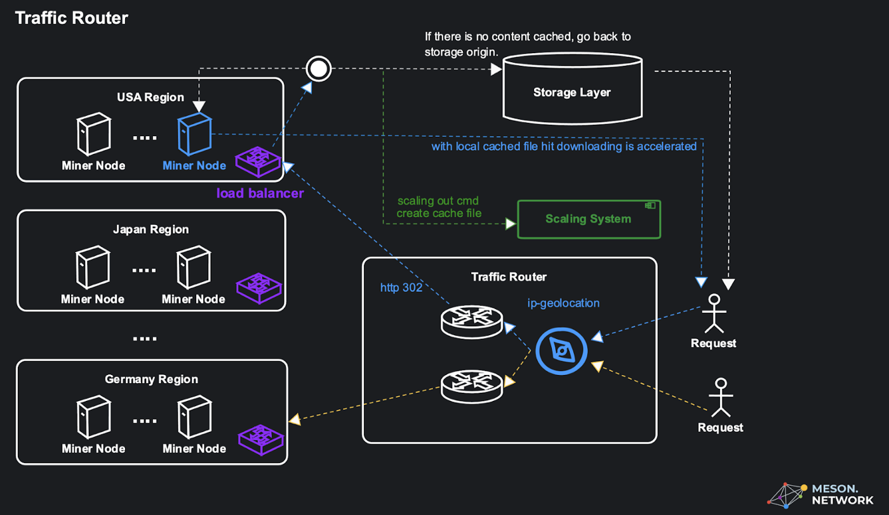
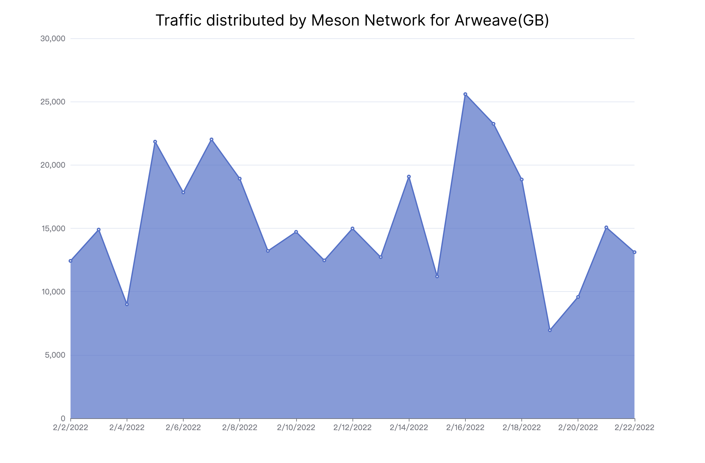
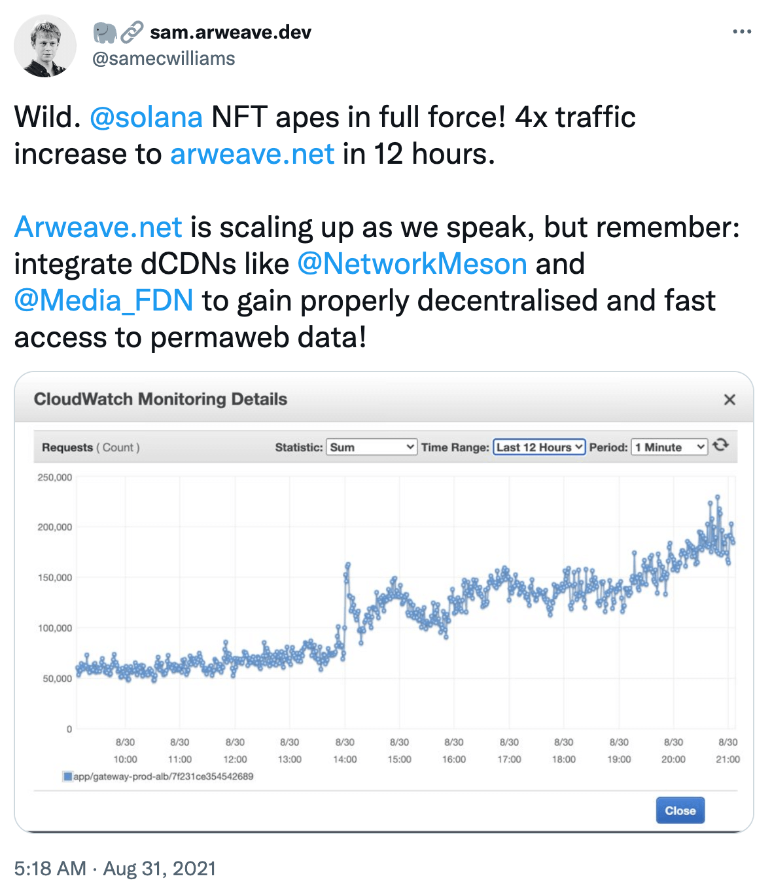

# Case Study: Arweave Gateway

>Use Meson Network to help Arweave Gateway alleviate the Retrieval bottleneck under high concurrent requests.

## Challenge

❓ **Arweave has a lot of pressure from NFT retrieval**

This is because NFT files are usually very small image files. Every time a user accesses an NFT, they need to make a request to the Gateway. The Gateway retrieves the NFT and returns it to the user.


❓ **Gateway encountered a physical bottleneck**

When the NFT Marketplace access surges at a certain point in time, these high concurrent requests may cause the server to run out of resources, causing the Gateway node to reach the ***CPU, I/O, Memory and Bandwidth Bound*** in the physical environment (you can learn from Brendan Gregg's [Systems Performance](https://www.goodreads.com/en/book/show/18058001-systems-performance) Learn more in the book).

❓ **Files need to be cached closer to the user to shorten the request speed of the user from the original site**

Using an origin server without a CDN means that each Internet request must return to the physical location of that Gateway server, regardless of where in the world it resides.

## Solution

✅ **Meson dCDN store (cache) Arweave in strategic locations in order to take the load off of Arweave Gateway**

By moving static assets like images, videos and audio (and potentially other content) as close as possible to the requesting meson node, a meson node cache is able to reduce the amount of time it takes for an Arweave resource to load.

✅ **Ability to easily retrieve Arweave content**

Customers can easily access content on the Arweave network without having to deploy and secure their own Arweave nodes. Meson’s gateway leverages Arweave nodes on its own resilient and security-hardened network to retrieve Arweave content. Meson Arweave gateway can be viewed as a cache in front of Arweave. The Meson Arweave Gateway cannot be used to modify or remove content from the Arweave network.

✅ **Ability to serve Arweave content through subdomain names**

A Gateway needs an SSL certificate in order to keep user data secure, prevent attackers from creating a fake version of the Gateway, and gain user trust.

✅ **Leverage dCDN for Arweave content (caching, performance, reliability)**

When using the Meson Arweave gateway, customers get the additional benefit of using the Meson CDN, which can cache Arweave content close to users, increasing overall performance.



## Example

Change the Arweave Gateway into the Meson Gateway. [Read More](https://docs.meson.network/using/meson-enhances-arweave.html)

```bash
https://arweave.net/-ZW0S2kqxYSRUHQW5AbBp046gLILFCZmxf37HoP1K4k
=>
https://{your_pull_zone}.meson.network/-ZW0S2kqxYSRUHQW5AbBp046gLILFCZmxf37HoP1K4k
```


[Meson enhance Arweave Demo](https://mesondemo.github.io/meson-arweave.html)

## Results




The Meson Gateway for Arweave has withstood high concurrent Retrieval requests from Arweave, and has been running stably for **500** days with **100%** online rate, which support **4072.77 TB** Arweave files to be retrieved. (As of August 5, 2022).

[](https://twitter.com/samecwilliams/status/1432452769785462797)

## Extended Reading

- [Meson enhance Arweave](https://docs.meson.network/using/meson-enhances-arweave.html)
- [Meson Mechanism](https://medium.com/meson-network/meson-enhance-arweave-86c8cabba8f2)
- [Sam Williams. 15 Aug 2021. Tweet.](https://twitter.com/samecwilliams/status/1426827828096610310)
- [Sam Williams. 31 Aug 2021. Tweet.](https://twitter.com/samecwilliams/status/1432452769785462797)

## Additional Examples

### Example 1: Using Meson Network for Video Streaming

Meson Network can be used to optimize video streaming by caching video files closer to the end-users. This reduces latency and improves the overall streaming experience. For instance, a video file stored on Arweave can be accessed through Meson Network, ensuring faster delivery and reduced buffering times.

### Example 2: Enhancing Web3 Applications

Web3 applications often rely on decentralized storage solutions like Arweave. By integrating Meson Network, these applications can benefit from improved performance and reliability. For example, a decentralized social media platform can use Meson Network to cache user-generated content, ensuring quick access and a seamless user experience.

### Example 3: Accelerating Content Delivery for E-commerce

E-commerce platforms can leverage Meson Network to accelerate the delivery of product images and other static assets. By caching these assets closer to the users, Meson Network ensures faster page load times and a better shopping experience. This can lead to higher conversion rates and increased customer satisfaction.

### Example 4: Optimizing API Responses

APIs are a critical component of modern applications. Meson Network can be used to cache API responses, reducing the load on the origin server and improving response times. For instance, an API that provides real-time stock prices can benefit from Meson Network by caching frequently requested data, ensuring quick and reliable access for users.

### Example 5: Supporting Decentralized Finance (DeFi) Platforms

DeFi platforms can use Meson Network to enhance the performance and reliability of their services. By caching transaction data and other critical information, Meson Network ensures that DeFi platforms can handle high traffic volumes and provide a seamless user experience. This is particularly important during periods of high market activity.

### Example 6: Improving User Experience for Online Gaming

Online gaming platforms can benefit from Meson Network by caching game assets and reducing latency. This ensures a smooth and responsive gaming experience for players. For example, a multiplayer online game can use Meson Network to cache game updates and assets, reducing the time it takes for players to download and access new content.

### Example 7: Enhancing Data Analytics

Data analytics platforms can use Meson Network to cache large datasets and improve query performance. By caching frequently accessed data, Meson Network reduces the load on the origin server and ensures quick access to critical information. This is particularly useful for real-time analytics and reporting.

### Example 8: Supporting IoT Applications

IoT applications often generate large volumes of data that need to be processed and analyzed in real-time. Meson Network can be used to cache IoT data, ensuring quick access and reducing latency. For example, a smart city application can use Meson Network to cache sensor data, enabling real-time monitoring and decision-making.

### Example 9: Facilitating Remote Work

Remote work platforms can benefit from Meson Network by caching documents and other resources closer to remote workers. This ensures quick access and reduces the time it takes to download and upload files. For instance, a remote collaboration tool can use Meson Network to cache project files, ensuring a smooth and efficient workflow for remote teams.

### Example 10: Enhancing Digital Marketing Campaigns

Digital marketing campaigns often rely on delivering personalized content to users. Meson Network can be used to cache marketing assets and ensure quick delivery. For example, a marketing platform can use Meson Network to cache personalized ads and promotional content, ensuring that users receive relevant and timely information.

